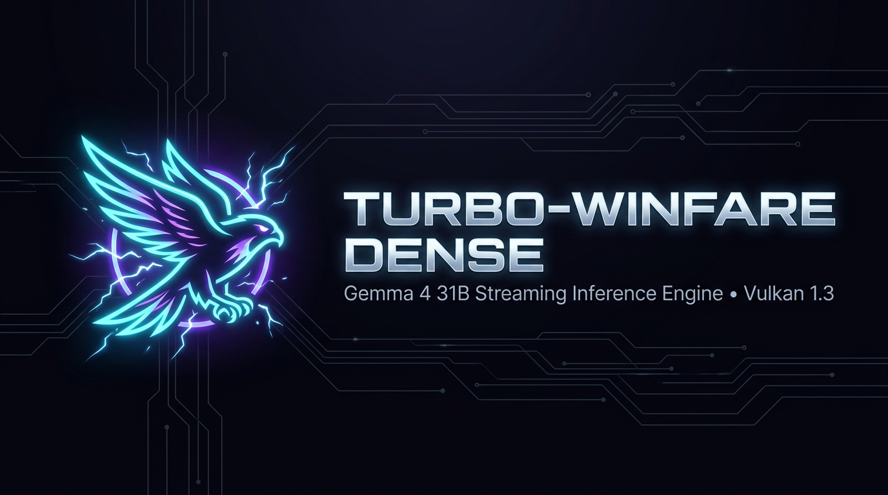

<div align="center">
  

  # Turbo-WinFare Dense

  **APU-Optimized Native Vulkan Streaming Inference Engine for Gemma 4 31B Dense**

  [](https://www.vulkan.org/)
  [](https://huggingface.co/google/gemma-4-31b-it)
  []()
  [](https://www.amd.com/)
  []()

</div>

---

An APU-optimized Vulkan inference engine for **Gemma 4 31B Dense**, targeting a Lenovo Legion Go
S (Ryzen Z1 Extreme, Radeon 780M, 32 GB LPDDR5X). It also runs **Gemma 4 E2B**, which serves as
the speculative draft model.

The 31B's weights are 15.06 GiB in INT4 and the driver stops accepting host-memory imports at
about 11.75 GiB, so **45 of 60 layers are resident and 15 stream from disk on every token**.
Most of this engine's design follows from that one fact.

**Current throughput: 1.13 tok/s** greedy decode at 45/60 resident, 4096 context.
`docs/PERFORMANCE.md` has the breakdown and `docs/ROUND9_REPORT.md` the most recent changes.

## Build

See `CONTRIBUTING.md` for the full setup. In short:

```powershell
python tools/bootstrap.py          # fetch w64devkit, DXC, Vulkan headers
python tools/bootstrap.py --verify # confirm the toolchain works
$env:PATH = "C:\w64devkit\bin;" + $env:PATH
cmake -S . -B build -G Ninja -DCMAKE_CXX_COMPILER=C:/w64devkit/bin/g++.exe
cmake --build build
```

## Run

```powershell
.\build\run_turbo_dense.exe --model models\gemma-4-31b-dense.g4dense --prompt "Hi" --max-tokens 24
.\build\run_turbo_dense.exe --model models\gemma-4-31b-dense.g4dense --gui     # web UI + OpenAI API
```

Useful flags: `--no-spec` (disable speculation), `--draft-k N` (drafts per verify round, capped
at 8), `--max-context N` (default 4096; 8192 costs ~336 MB of KV cache, about one resident
layer), `--temp`, `--top-p`, `--top-k`.

### The web UI

`--gui` serves a control panel and an OpenAI-compatible API on the same port. Everything the
CLI can set is settable there — sampling (temperature, top-p, top-k, repetition penalty, seed),
generation length, speculation on/off and its K, and context length — plus live telemetry:
per-token phase breakdown, memory by pool, which layers are resident against which stream, and
speculative acceptance with its denominator.

Two things it deliberately does not do: it never substitutes a plausible value for telemetry it
does not have (missing readings show `—`), and it does not claim a speculative speedup, because
measuring one honestly means running the same prompt both ways and the server does not do that.

| endpoint | |
|---|---|
| `POST /v1/chat/completions` | OpenAI-compatible, streaming or not |
| `GET /v1/models`, `GET /api/models` | available containers |
| `GET/POST /api/config` | sampling, speculation, context; a context change reports `requires_reload` |
| `GET /api/telemetry` | throughput, phase breakdown, memory, speculation counters |
| `GET /api/model_info` | geometry, and which layers stream |
| `POST /api/load_model`, `/api/unload_model` | swap the container in place |
| `POST /api/reset_kv`, `/api/clear_cache`, `/api/stop` | reset context, drop stream slots, cancel |

## Models

Containers are `.g4dense` v3, built from MLX 4-bit HuggingFace checkpoints:

```powershell
python tools/convert_hf_to_g4dense.py --input models\gemma-4-31b-it-4bit --out models\gemma-4-31b-dense.g4dense
python tools/verify_weights.py models\gemma-4-31b-dense.g4dense
```

`docs/G4DENSE_FORMAT.md` is the format spec. **A v2 container is rejected, not upgraded** — v3
16-byte-aligns the packed-weight blocks, so a v2 file read as v3 decodes at the wrong offsets
and produces plausible-looking garbage. Weights and `.g4dense` bundles are gitignored and never
committed.

## Test fixtures are not in git, and go stale silently

`*.g4dense` is gitignored, which includes two things the test suite depends on. Neither
regenerates automatically, and a stale copy fails in ways that look like engine bugs — a stale
`oracle_tensors/` had `run_gpu_forward_test` and `run_smoke_engine_test` failing for an entire
round against an oracle that predated a softcapping change.

```powershell
# The 4-layer synthetic fixture (fast, no GPU or real model needed)
python tools\make_synthetic_model.py --out tests\fixtures\tiny.g4dense
python tools\make_synthetic_model.py --out tests\fixtures\tiny.g4dense --verify

# The CPU-oracle dumps the GPU forward pass is graded against.
# Minutes per token: it runs the full 31B on the CPU.
.\build\run_cpu_reference_test.exe models\gemma-4-31b-dense.g4dense tests\fixtures\oracle_tensors 2
```

**Regenerate both after any change to the container layout.** The per-layer layout is spelled
out in five places (`docs/G4DENSE_FORMAT.md` §4.2 lists them) and they must move together.

## Verifying a change

```powershell
ctest --test-dir build --output-on-failure     # 16 of 16

.\build\run_gpu_forward_test.exe models\gemma-4-31b-dense.g4dense tests\fixtures\oracle_multi "2,3689,563,506"
.\build\run_gpu_forward_test.exe models\gemma-4-e2b-dense.g4dense  tests\fixtures\oracle_e2b   "2,3689,563,506"
.\build\run_real_generation_test.exe 24        # READ THE TEXT -- it asserts only that tokens appeared
```

Both models must stay argmax- and top-5-exact against their oracles. `run_real_generation_test`
cannot judge coherence; a human has to read the output.

**On benchmarking**, from `docs/PERFORMANCE.md` §6 — each rule cost a wrong conclusion:
three runs minimum per variant, compare variants within one session, confirm the disk is idle
first, and never pipe a verification command (`| head` once reported exit 0 for a process
crashing with exit 29).

## Layout

| | |
|---|---|
| `src/`, `include/g4dense/` | engine — `runner.cpp` is the forward pass, `streamer.cpp` the layer I/O |
| `shaders/` | HLSL compiled to SPIR-V by `tools/compile_shaders.py` |
| `tools/` | conversion, verification, the NumPy reference, benchmarks |
| `docs/` | `PERFORMANCE.md`, `G4DENSE_FORMAT.md`, `FORWARD_PASS.md`, per-round reports |
